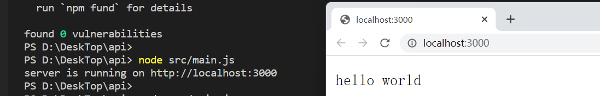
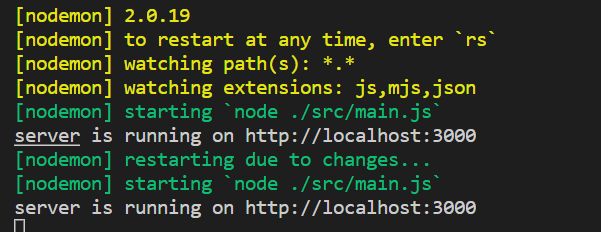
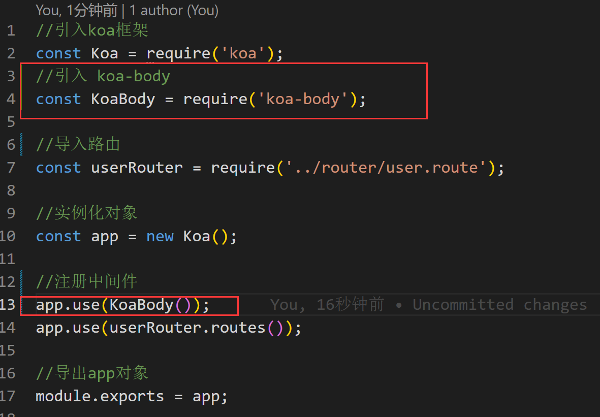
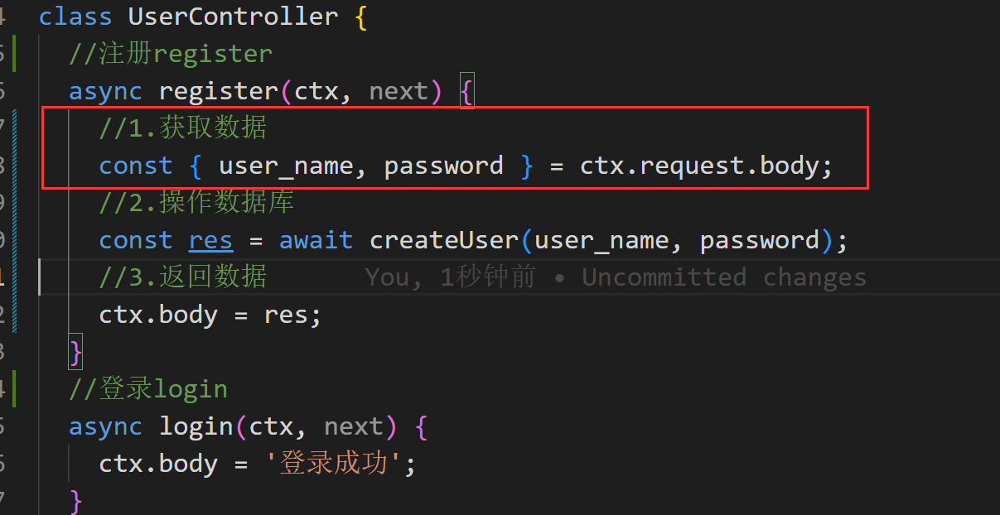
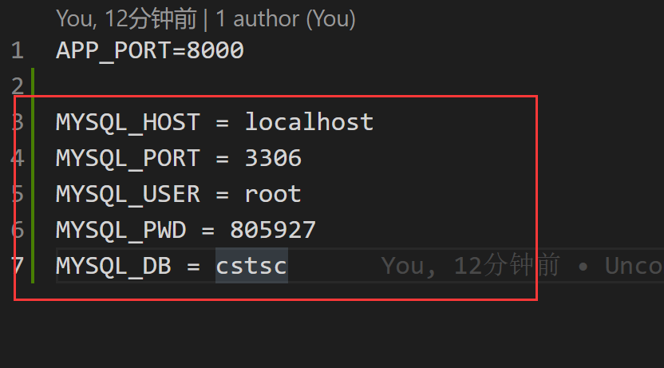

# 一、项目的初始化

## 1 npm初始化

```
npm init -y
```

生成 `package.json`文件：

- 记录项目的依赖

## 2 git初始化

```
git init
```

生成.git隐藏文件夹，git的本地仓库

### 3 创建 ReadMe 文件

# 二、搭建项目

## 1 安装Koa框架

```
npm install koa
```

## 2 编写最基础的app

创建`src/main.js`

```
const Koa = require('koa')

const app = new Koa()

app.use((ctx, next) => {
  ctx.body = 'hello world'
})

app.listen(3000, () => {
  console.log('server is running on http://localhost:3000')
})
```

# 3 测试

在终端，使用`node src/main.js`



# 三、项目的基本优化

## 1 自动重启服务

安装nodemon工具

```
npm i nodemon -D
```

编写`package.json`脚本

```
"scripts": {
    "dev": "nodemon ./src/main.js",
    "test": "echo \"Error: no test specified\" && exit 1"
  },
```

执行`npm run dev`启动服务



## 2 读取配置文件

安装`dotenv`，读取根目录中的`.env`文件，将配置写`process.env`中

```
npm i dotenv
```

创建`.env`文件

```
APP_PORT=8000
```

创建`src/config/config.default.js`

```
const dotenv = require('dotenv')

dotenv.config()

// console.log(process.env.APP_PORT)

module.exports = process.env
```

改写`main.js`

```
const Koa = require('koa');

const { APP_PORT } = require('./config/config.default');

const app = new Koa();

app.use((ctx, next) => {
  ctx.body = 'hello api';
});

app.listen(APP_PORT, () => {
  console.log(`server is running on http://localhost:${APP_PORT}`);
});

```

# 四、添加路由

路由：根据不同的URL，调用对应处理函数

## 1 安装koa-router

```
npm i koa-router
```

步骤：

1. 导入包
2. 实例化对象
3. 编写路由
4. 注册中间件

## 2 编写路由

创建`src/router`目录，编写`user.route.js`

```js
//导入koa-router
const Router = require('koa-router');

//实例化一个路由对象
const router = new Router({ prefix: '/users' }); //使用统一的前缀

//编写路由
// GET /users/
router.get('/', (ctx, next) => {
  ctx.body = 'hello users';
});

//导出路由对象
module.exports = router;
```

### 3 改写main.js

```js
const Koa = require('koa');

const { APP_PORT } = require('./config/config.default');

//导入编写好的router
const userRouter = require('./router/user.route')

const app = new Koa();

//注册中间件
app.use(userRouter.routes())

app.listen(APP_PORT, () => {
  console.log(`server is running on http://localhost:${APP_PORT}`);
});

```

# 五、目录结构优化

## 1 将`http`服务和`app`业务拆分

创建`src/app/index.js`负责`app`业务

```js
//引入koa框架
const Koa = require('koa');

//导入路由
const userRouter = require('../router/user.route');

//实例化对象
const app = new Koa();

//注册路由
app.use(userRouter.routes());

//导出app对象
module.exports = app;
```

`src/main.js`负责`http`服务

```js
//引入 APP_PORT
const { APP_PORT } = require('./config/config.default');
//导入app
const app = require('./app')
app.listen(APP_PORT, () => {
  console.log(`server is running on http://localhost:${APP_PORT}`);
});
```


## 2 将路由和控制器拆分

路由：解析URL，分发给控制器对应的方法

控制器：处理不同的业务

改写`src/router/user.route.js`

```js
//导入koa-router
const Router = require('koa-router');

//导入接口
const { register,login } = require('../controller/user.controller');

//实例化一个路由对象
const router = new Router({ prefix: '/users' }); //url前缀

//设置register接口路由
router.post('/register', register);

//设置login接口路由
router.post('/login', login);

//导出路由对象
module.exports = router;
```

创建`src/controller/user.controller.js`

```js
//创建UserController类
class UserController {
  async register(ctx, next) {
    ctx.body = '用户注册成功';
  }
  async login(ctx, next) {
    ctx.body = '登录成功';
  }
}
//导出UserController对象
module.exports = new UserController();
```

# 六、解析body

## 1 安装koa-body

```
npm init koa-body
```

## 2 注册中间件

改写`app/index.js`



## 3 解析请求数据

改写`user.controller.js`



## 4 拆分service层

service层主要是做数据库处理

创建`src/service/user.service.js`

```js
//创建UserServeice对象
class UserService {
  //创建user
  async createUser(user_name, password) {
    // todo: 写入数据库
    return '写入数据库成功';
  }
}
//导出UserService对象
module.exports = new UserService();
```

# 七、数据库操作

sequelize ORM数据库工具

ORM：对象关系映射

- 数据表映射一个类
- 数据表中的数据行映射一个对象
- 数据表字段映射对象属性
- 数据表的操作映射对象方法

## 1 安装sequelize

```
npm i sequelize mysql2
```

## 2 连接数据库

`sec/db/seq.js`

```js
//导入sequelize
const { Sequelize } = require('sequelize');
//导入数据库变量
const {
  MYSQL_HOST,
  MYSQL_PORT,
  MYSQL_USER,
  MYSQL_PWD,
  MYSQL_DB,
} = require('../config/config.default');
//实例化Sequelize对象
const seq = new Sequelize(MYSQL_DB, MYSQL_USER, MYSQL_PWD, {
  host: MYSQL_HOST,
  dialect: 'mysql',
});
//检验连接是否成功
seq
  .authenticate()
  .then(() => {
    console.log('数据库连接成功');
  })
  .catch((err) => {
    console.log('数据库连接失败 err === ', err);
  });
```

## 3 编写配置文件

`.env`文件



# 八、创建User模型

## 1 拆分Model层

sequelize主要通过Model对应数据表

创建`src/model/user.model.js`

```js
//引入DataType数据类型
const { DataTypes } = require('sequelize');
//引入seq对象
const seq = require('../db/seq');

//创建模型(Model cst_user => cst_users)
const User = seq.define('cst_user', {
  //id会被requelize自动创建，管理
  user_name: {
    type: DataTypes.STRING,
    allowNull: false,
    unique: true,
    comment: '用户名， 唯一',
  },
  password: {
    type: DataTypes.CHAR(64),
    allowNull: false,
    comment: '密码',
  },
  is_admin: {
    type: DataTypes.BOOLEAN,
    allowNull: false,
    defaultValue: 0,
    comment: '是否为管理员， 0:不是管理员(默认),1:是管理员',
  },
});

//强制同步数据库(如果表已存在，则先删除)
// User.sync({force: true});

module.exports = User

```

# 九、添加用户入库

改写`user.controller.js`

```js
//导入userService对象
const { createUser } = require('../service/user.service.js');
//创建UserController类
class UserController {
  //注册register
  async register(ctx, next) {
    //1.获取数据
    const { user_name, password } = ctx.request.body;
    //2.操作数据库
    const res = await createUser(user_name, password);
    //3.返回结果
    ctx.body = {
      code: 0,
      message: '用户注册成功',
      result: {
        id: res.id,
        user_name: res.user_name,
      }
    };
  }
  //登录login
  async login(ctx, next) {
    ctx.body = '登录成功';
  }
}
//导出UserController对象
module.exports = new UserController();

```

# 十、错误处理

改写`src/controller/user.controller.js`

```js
//导入userService对象
const { createUser, getUserInfo } = require('../service/user.service.js');
//创建UserController类
class UserController {
  //注册register
  async register(ctx, next) {
    //1.获取数据
    const { user_name, password } = ctx.request.body;
    // 合法性（用户名或密码为空）
    if (!user_name || !password) {
      console.error('用户名或密码为空', ctx.request.body); // 错误日志
      ctx.status = 400; // bad request
      ctx.body = {
        code: '10001',
        message: '用户名或密码为空',
        result: '',
      };
      return;
    }
    // 合理性（用户存在）
    if (getUserInfo({ user_name })) {
      ctx.status = 409; // conflict
      ctx.body = {
        code: '10002',
        message: '用户已经存在',
        result: ''
      }
      return;
    }

    //2.操作数据库
    const res = await createUser(user_name, password);
    //3.返回结果
    ctx.body = {
      code: 0,
      message: '用户注册成功',
      result: {
        id: res.id,
        user_name: res.user_name,
      },
    };
  }
  //登录login
  async login(ctx, next) {
    ctx.body = '登录成功';
  }
}
//导出UserController对象
module.exports = new UserController();

```

# 十一、拆分中间件

## 1. 拆分中间件

创建`middle/user.middleware.js`

```js
const { getUserInfo } = require('../service/user.service');
const {
  userFormateError,
  userAlreadyExited,
  userRegiterError,
} = require('../constant/err.type');

const userValidator = async (ctx, next) => {
  const { user_name, password } = ctx.request.body;
  // 合法性
  if (!user_name || !password) {
    console.error('用户名或密码为空', ctx.request.body); // 错误日志
    ctx.app.emit('error', userFormateError, ctx);
    return;
  }

  await next();
};

const verifyUser = async (ctx, next) => {
  const { user_name } = ctx.request.body;
  try {
    const res = await getUserInfo({ user_name });
    if (res) {
      console.error('用户名已经存在', user_name);
      ctx.app.emit('error', userAlreadyExited, ctx);
      return;
    }
  } catch (err) {
    console.error('获取用户信息错误', err);
    ctx.app.emit('error', userRegiterError, ctx);
    return;
  }
  await next();
};

module.exports = { userValidator, verifyUser };

```


## 2. 统一错误处理

改写`src/index.js`

```js
// 引入 错误处理 
const errHandler = require('./errHandler')

// 统一的错误处理
app.on('error', errHandler);

```


## 3. 错误处理函数

创建`src/errHandler.js`

```js
module.exports = (err, ctx) => {
  let status = 500;
  switch (err.code) {
    case '10001':
      status = 400
      break
    case '10002':
      status = 409
      break
    default:
      status = 500
  }
  ctx.status = status;
  ctx.body = err;
}
```

# 十二、加密

在将密码保存到数据库之前，要对密码进行加密处理

## 1 安装bcryptjs

```
npm i bcryptjs
```

## 2 编写加密中间件

```js
/**
 * 加密 密码
 */
const crpytPassword = async (ctx, next) => {
  console.log('ctx======', ctx);
  // 获取 明文 密码
  const { password } = ctx.request.body;
  // 生成 盐
  const salt = bcrypt.genSaltSync(10);
  // 加密
  const hash = bcrypt.hashSync(password, salt);
  ctx.request.body.password = hash;
  await next();
}
```


## 3 在 router 中使用

```
/**
 * 设置register接口路由
 */
router.post('/register', userValidator, verifyUser, crpytPassword, register);
```

# 十三、验证登录

`middleware/user.middleware.js`

```
/**
 * 验证 登录
 * @param {Object} ctx 前端传参
 * @param {Function} next 下一步执行的函数
 * @returns {Object} 登录错误
 */
const verifyLogin = async (ctx, next) => {
  // 获取 前端 传参
  const { user_name, password } = ctx.request.body;
  try {
    // 查找 数据库 用户
    const res = await getUserInfo({ user_name });
    // 1. 判断用户是否存在（不存在：报错）
    if (!res) {
      console.error('用户名不存在', { user_name });
      ctx.app.emit('error', userDoesNotExists, ctx);
      return;
    }
    // 2. 密码是否匹配（不匹配：报错）
    if (!bcrypt.compareSync(password, res.password)) {
      ctx.app.emit('error', invalidPassword, ctx);
      return;
    }
  } catch (err) {
    console.error(err);
    return ctx.app.emit('error', userLoginError, ctx);
  }
  await next();
}
```

`router/user.route.js`

```
/**
 * 登录 接口
 */
router.post('/login', userValidator, verifyLogin, login);
```


# 十四、用户认证

登录成功后，给用户颁发一个令牌token，用户在以后的每一次请求中携带这个令牌

jwt: json web token

- header: 头部
- playload: 载荷
- signature：签名

## 1 安装jsonwebtoken

```
npm i jsonwebtoken
```

## 2 颁发token

`controller/user.controller.js`

```js
/**
   * 登录 操作
   * @param {Object} ctx 
   * @param {Function} next 
   */
  async login (ctx, next) {
    const { user_name } = ctx.request.body;
    // 1. 获取用户令牌
    try {
      // 从返回结果对象中剔除password属性，将剩下的属性放到res对象
      const { password, ...res } = await getUserInfo({ user_name });
      ctx.body = {
        code: 0,
        message: '用户登录成功',
        result: {
          token: jwt.sign(res, JWT_SECRET, {expiresIn: '1d'}),
        },
      };
    } catch (err) {
      console.error('用户登录失败', err);
    }

  }
```

## 3 定义私钥

`.env` 

```
JWT_SECRET = xzd
```


## 4 token认证

`middleware/auth.middleware.js`

```js
// 引入 jwt 对象
const jwt = require('jsonwebtoken')
// 引入 JWT配置
const { JWT_SECRET } = require('../config/config.default')
// 引入 错误类型
const { tokenExpiredError, invalidToken } = require('../constant/err.type');
/**
 * token认证
 * @param {Object} ctx 
 * @param {Function} next 
 * @returns 
 */
const auth = async (ctx, next) => {
  // 获取 前端传入的 authorization
  const { authorization} = ctx.request.header;
  console.log('authorization ======', authorization);
  // 获取 前端传入的 token
  const token = authorization.replace('Bearer ', '');
  try {
    // 验证 token 是否合法
    const user = jwt.verify(token, JWT_SECRET);
    ctx.state.user = user;
  } catch (err) { // token
    switch (err.name) {
      // token 已过期
      case 'TokenExpiredError':
        console.error('token已过期', err);
        return ctx.app.emit('error', tokenExpiredError, ctx);
      // 无效的 token
      case 'JsonWebTokenError':
        console.error('无效的token', err);
        return ctx.app.emit('error', invalidToken, ctx);
    }
  }
  await next();
}
module.exports = {
  auth
}
```

`router/user.router.js`

```
/**
 * 修改密码接口
 */
router.patch('/', auth, (ctx, next) => {
  console.log(ctx.state.user);
  ctx.body = '修改密码成功';
})
```

## 4 修改密码

`service/user.service.js`

```js
 /**
   * 修改 密码
   * @param {Obect} param0 
   */
async updateById ({id, user_name, password, is_admin}) {
    const whereOpt = { id };
    const newUser = {}
    user_name && Object.assign(newUser, {user_name})
    password && Object.assign(newUser, {password})
    is_admin && Object.assign(newUser, { is_admin })
    const res = await User.update(newUser, { where: whereOpt })
    return res[0] > 0 ? true : false;
}
```

`controller/user,controller.js`

```js
/**
   * 修改 密码
   */
async changePassword (ctx, next) {
    // 1. 获取数据
    const id = ctx.state.user.id;
    const password = ctx.request.body.password;
    // 2. 操作数据库
    if (await updateById({ id, password })) {
      ctx.body = {
        code: 0,
        message: '修改密码成功',
        result: '',
      }
    } else {
      ctx.body = {
        code: '10007',
        message: '修改密码失败',
        result: '',
      }
    }
    // 3. 返回结果
}
```

`router/user.route.js`

```js
/**
 * 修改密码接口
 */
router.patch('/', auth, crpytPassword, changePassword);
```

# 十五、路由自动加载

新增`router/index.js`

```js
// 导入 fs 对象
const fs = require('fs')
// 导入 router 对象
const Router = require('koa-router');
// 创建 router 实例
const router = new Router();
// 读取 fs 文件名
fs.readdirSync(__dirname).forEach(file => {
  // 如果 文件名 不为 index.js
  if (file !== 'index.js') {
    // 动态生成 路由
    let r = require('./' + file);
    // 注册 路由
    router.use(r.routes())
  }
})
// 导出 路由
module.exports = router
```

`app/index.js`

```js
// 导入 路由
const router = require('../router')
// 注册 中间件
app.use(router.routes())
```

# 十六、封装管理员权限
